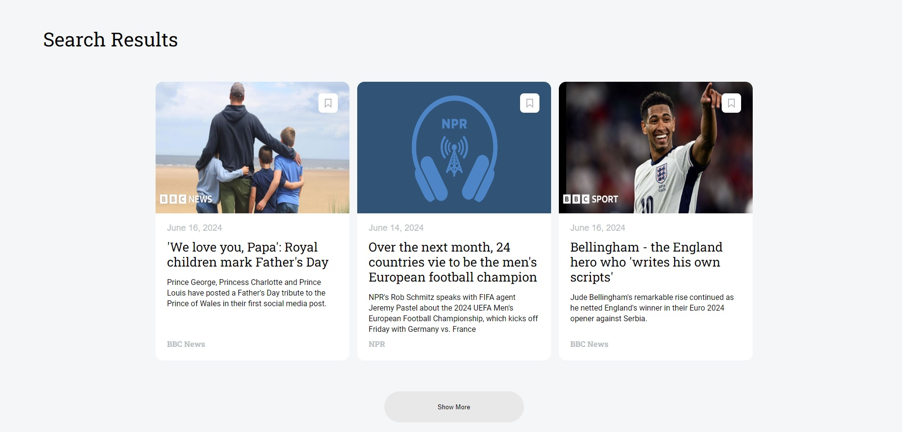

# News Explorer

As the title suggests, users can search various headlines by keywords, finding the news they like, and saving them to their private page for future references.

## Features

- Semantic HTML5
- Flexbox
- Positioning
- API calls to NewsApi
- Supports screen widths of 1440px, 768px, and 320px;
- CSS animation and transform;

## Authors

- [@DmitriySlinkovenko](https://github.com/DmitriySlinkovenko)

## Deployment

To deploy this project run

```bash
  npm run deploy
```

Will be deployed to Google Cloud once my back-end gets finished.

## Screenshots



